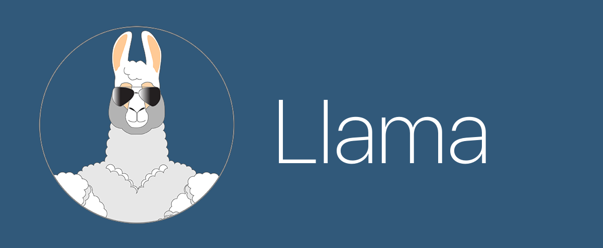

===
## React Native app for gender equality in public
* #### location based
* #### notifies allies if someone is unsafe
* #### tracks location of allies, so unsafe person will know where to go
* #### PROFIT! walking together is safer

## Demo

&nbsp; 

## Technologies used
* Javascript / ES6 
* React Native
* Cocoapods
* Socket.io
* Google Maps API
* Apple Push Notification service
* Here's [Node.js Backend Server](https://github.com/Nukki/Llama-Backend)
&nbsp;

## Team Mojito Hacks
* [Nikki Jack](https://github.com/Nukki) - Full-Stack Developer
* [Andre Pykhantsev](https://github.com/nblxanueb) - Front-End Developer
* Ricarldo Enrique - Marketing Expert
